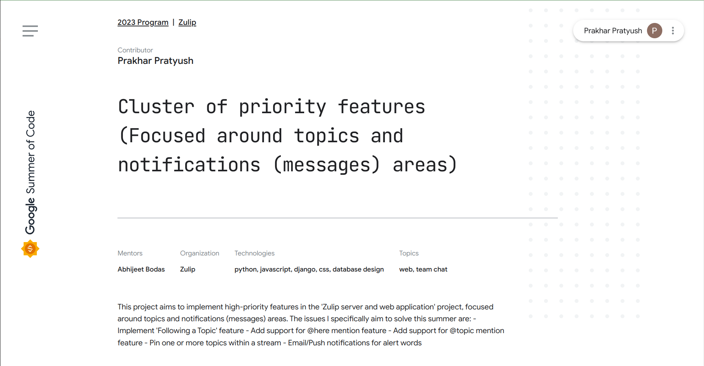
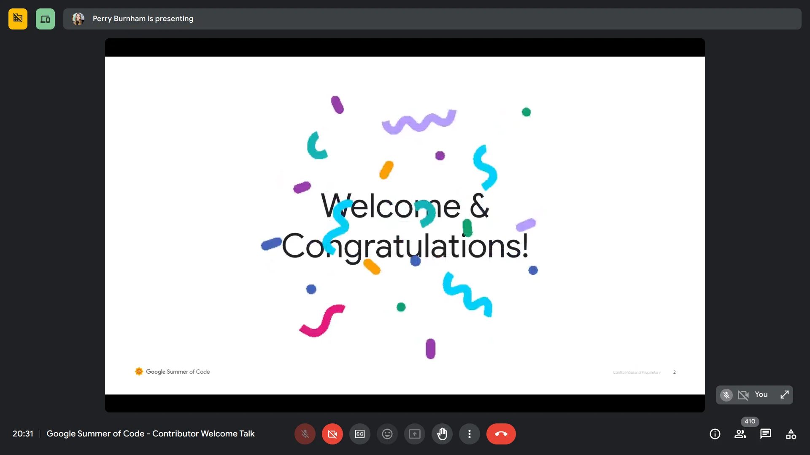

Amid end-semester exams, I received an early message about being accepted as a contributor to [Zulip](https://zulip.com/) for the GSoC'23 cohort because of a sweet bug on the GSoC website (credits to [Palash](https://github.com/palashb01) 😄).

and later that day, officially via mail, by the GSoC Team. 🎉

[Project:](https://summerofcode.withgoogle.com/archive/2023/projects/ijktWPlO)

## Community Bonding: Week 0

Since everyone participating as a GSoC contributor to [Zulip](https://github.com/zulip/zulip) has been contributing to Zulip for a few months now, we have already achieved the goal of the community bonding period as [suggested by the GSoC Team](https://google.github.io/gsocguides/student/how-gsoc-works).

> Google Summer of Code moves in phases after you are accepted. The first phase is the Community Bonding Period (~3 weeks) in which you get to know your community and get familiar with their code base and work style.

At [Zulip](https://github.com/zulip/zulip), the aim for this period is to either continue the project we're already working on or plan and discuss a new project of our interest with the community.

At Zulip, the team doesn't worry too much about completing the exact set of issues or projects we mentioned in our proposal; we are encouraged to discuss and work on any impactful project of our interest over the summer. 💙

[As per Zulip docs:](https://zulip.readthedocs.io/en/latest/outreach/experience.html#what-about-my-proposal)

> We have a fluid approach to planning, which means you are very unlikely to end up working on the exact set of issues described in your proposal. Your proposal is not a strict commitment (on either side).

> While some program participants stick closely to the spirit of their proposal, others find new areas they are excited about in the course of their work. You can be highly successful in the program either way!

Cool, isn't it?

With my sparse availability due to exams, I was able to do the following things this week:

* had a meeting with the mentor, [Abhijeet Bodas.](https://github.com/abhijeetbodas2001)

* started the [product](https://chat.zulip.org/#narrow/stream/101-design/topic/notifications.20of.20Followed.20Topics/near/1565267) and [technical](https://chat.zulip.org/#narrow/stream/3-backend/topic/Follow.20Topics/near/1564073) discussions around the ["Follow Topics" feature](https://github.com/zulip/zulip/issues/6027) in the community. I'm quite excited about this feature, 🙌.
    
* attended the "Contributor Welcome Talk," which the GSoC team organized.
    
    
    

That's all for now.

---

**Bonus**: The [Zulip 7.0 release](https://chat.zulip.org/#narrow/stream/438-release-management/topic/7.2E0.20release.20logistics/near/1560607) is planned for the last week of May; stay tuned for a bunch of exciting features.

I'm particularly excited about the **"Unmute Topics"** feature; it was great to collaborate with folks to make it possible over the past 3 months. 🚀

PS: The feature is one of the five most requested features for the Zulip project as a whole and was [first reported](https://github.com/zulip/zulip/issues/2517) in 2016 (~7 years ago). 👀

Cheers!
