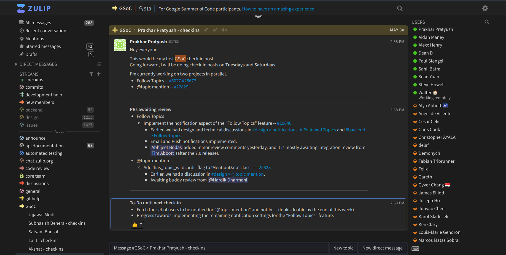

Hello folks,  
  
The last two weeks for me were all about managing GSoC and the last few days at college. :)

I have started working on two interesting projects in parallel:

* [Following a topic](https://github.com/zulip/zulip/issues/6027): *One of the 5 most requested features for the Zulip project overall*
* [@topic mention](https://github.com/zulip/zulip/issues/22829): [*Rust community request*](https://rust-lang.zulipchat.com/#narrow/stream/122653-zulip/topic/read.20receipts/near/292249587)

---

Apart from attending the [contributors' summit organized by the GSoC Team](https://www.youtube.com/live/1jiHwjgE9Ys?feature=share), I was mostly involved in going through the [subsystem docs](https://zulip.readthedocs.io/en/latest/subsystems/index.html) (once again) and [design discussions](https://chat.zulip.org/#narrow/stream/101-design/topic/notifications.20of.20Followed.20Topics/near/1565267) before starting the actual coding part.

Hats off to the Zulip team and the contributors who have maintained such detailed (150k words) and high-quality documentation. 🎉

* Personally, it was fun to learn about the various design decisions taken to simplify problems like the ["idle desktop problem",](https://zulip.readthedocs.io/en/latest/subsystems/notifications.html#important-corner-cases) and ["hard disconnect problem"](https://zulip.readthedocs.io/en/latest/subsystems/notifications.html#important-corner-cases) involved with notification implementation in chat products.
    
* The ["soft deactivation"](https://zulip.readthedocs.io/en/latest/subsystems/sending-messages.html#soft-deactivation) and ["local echo"](https://zulip.readthedocs.io/en/latest/subsystems/sending-messages.html#local-echo) techniques that Zulip uses to reduce latency while sending messages were the other two things that felt like beautiful pieces of engineering work to me. 💙
    
* Understanding the complete process behind RabbitMQ, Tornado, and Django working together to implement the [real-time push system of zulip](https://zulip.readthedocs.io/en/latest/subsystems/events-system.html) (long polling) was a bit hard initially, but it was worth the effort and time. 🙌
    
* As a part of working on the ["@topic mention"](https://github.com/zulip/zulip/issues/22829) feature, I also got the opportunity to go down the [markdown lane](https://zulip.readthedocs.io/en/latest/subsystems/markdown.html). (Well, still a lot to cover; some another day)

This week, we also got the [question](https://chat.zulip.org/#narrow/stream/3-backend/topic/Follow.20Topics/near/1575704) of how multiple smaller database migrations should ideally be handled.

*do migrations with the server down?* *or announcing a maintenance period?* *or a series of migrations that can each be done without downtime?*

We had a [brief discussion](https://chat.zulip.org/#narrow/stream/3-backend/topic/Follow.20Topics/near/1578837) about it, and it made a lot of things around database migrations in larger organizations clear to me. 🚀

---

**Regarding the PRs, I'm working on:**

We do a regular check-in at [chat.zulip.org](https://chat.zulip.org/) (all the communication around Zulip development takes place here) to keep everyone updated on our work:

[*#25640*](https://github.com/zulip/zulip/pull/25640) and [*#25828*](https://github.com/zulip/zulip/pull/25828) are the PRs I'm currently working on in parallel.

That's all for now!

Cheers! 🎉  
  
ps: [World Test Championship Final](https://g.co/kgs/w5eJDN) is starting on June 7, excited? 👀
